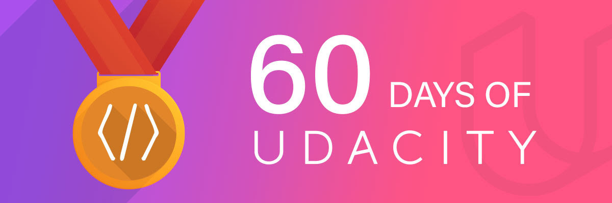

# 60 Days Streak to Learn 30 minutes in Deep Learning and Machine Learning

# Day 1
- [x] Pledged Taken
- [x] Revised PyTorch Notes
- [x] Data Transformation Documents Reading

# Day 2
- [x] Lesson 3 completed 
- [x] Successfully organized Book with the Basics
- [x] Started writing medium post on PyTorch Introduction
- [x] Started Discussion on Projects

# Day 3
[x] Grabs basics on Activation Functions
- [x] Searched for Different Journals Publication
- [x] Completed Lesson 4
- [x] Worked on script to download multiple Google images to create Dataset
It's heavy day but learned a lot... So much satisfying :aaw_yeah:

# Day 4/60 #60DaysOfUdacity
✓ Listened podcast on Neural Networks
✓ Attended meetup of PyData
✓ Read blog on Multilayer Perceptron with PyTorch
✓ Encouraged sayalikutwal26

# Day 5/60 #60DaysOfUdacity
✓ Completed Lesson 6
✓ Organized :mic_drop_boom: *Boom with the Basics* :mic_drop_boom: along with  jordi.frank1994
✓ First Virtual Meetup with  nishant.bharatindia jenashubhangi20 sayalikutwal26 aarthialagammai21 bharati.frnds pratikthakare65
✓ Discussed Emotion Detection Project
✓ Discussed MLP and CNN Concepts
✓ Started on Working on Data Gathering Phase
✓ Encouraged  aisha.jv70 hantwin

# Day 6/60 #60DaysOfUdacity
✓ Read Research paper on Faster RCNN Implementation
✓ Revised the concept of Transfer Learning
✓ Review project of Number Plate Detection
:panda_dance: :aaw_yeah:

I encourage to  jordi.frank1994 jckuri dushyantpathak6789 electric.blake anjumercian85 anna.kondra

# Day 7/60 #60DaysOfUdacity
✓ Kicks off project on Emotion Detection
✓ Completed Lesson 7
✓ Revised Andrew NG Course.

Tagging  saiharsha2013 nasipurisoumya

# Day 8/60 #60DaysOfUdacity
✓ Started lessons 8
✓ Doing research on strides and padding
✓ Read formulas of Confusion Matrix.

I am tagging  seeratpal91 honeyjindgar harshitjain1309 mikaelaysanchez silu.patel1997 labknr98 rajvirdhakhada7

# Day 9/10 #60DaysOfUdacity
✓ Continue Lesson 8
✓ Read research Paper on *Image Classification using Neural Network for
Efficient Image Retrieval*
✓ Started exploring project on Dentist Cavity Detection using PyTorch.

I am encouraging  Juan Carlos Kuri Pinto  Harshit Jain  Rohan21  Sayali_Kutwal  Shubhangi Jena  Jordi F.  hannakond  Halwai Aftab Hasan  Anju Mercian  Shubham0812   Labiba  Mika  Nishant Bharat  emrebegen for sharing.

# Day 10 #60DaysOfUdacity
✓ Continue Lesson 8
✓ Attended Virtual Meetup with  Nishant Bharat  Shubhangi Jena  Aarthi Alagammai  Bharati Subramanian  Prateek Thakare  Poornima Venkatraman
✓ As a part of Emotion Detection project Started with pre-processing, data cleaning and convert RGB image to grey scale image using  PyTorch
✓ Started discussion on Study Group Activities #sg_caffeine_coders

Thanks for Motivating me specially  Labiba  Juan Carlos Kuri Pinto  Prateek Thakare

I am tagging and share with  Soumya Nasipuri  Taimur Zahid  Archit  Yemi  Aisha Javed  PRAXS

# Day 11/60 #60DaysOfUdacity
✓ Data Cleaning is done for Emotion detection
✓ Discussed in #sg_caffeine_coders for Research Paper reading
✓ Continue lesson 8
✓ Revised lesson for Data Loader and Image Loader in PyTorch. 
✓ Started Reading research paper on Differential Privacy using Deep Learning by Ian Goodfellow
https://storage.googleapis.com/pub-tools-public-publication-data/pdf/45428.pdf

I am encouraging  Halwai Aftab Hasan  Soumya Nasipuri  Taimur Zahid  Labiba  PRAXS

# Day 12 #60DaysOfUdacity
✓ Completed Lesson 8
✓ Virtual Meetup with #sg_caffeine_coders study group with  Nishant Bharat  Shubhangi Jena  Aarthi Alagammai  Poornima Venkatraman  Prateek Thakare
✓ Another meetup with :awesome-ball: guys  Sourav  Shivam Raisharma  Aisha Khatun  Soumya Nasipuri  Oudarjya Sen Sarma  Bhadresh Savani
✓ Loading Data in Emotion Detection Project

Loved to work with  Nishant Bharat and great lead by  Shubhangi Jena Keep Going !!!!

# Day 13 #60daysofudacity
- [x] Completed Reading research paper on *Image classification using Neural Networks* by Prashant Italiya. Learned how to start writing research paper.
:heavy_check_mark: Stuck with Emotion Detection on working combined emotion in one image.
:heavy_check_mark: Started Fast.ai course Lesson 1 Image Classification.

My #60daysofudacity timeline : https://medium.com/series/d53ca304938f

Shout-out to @Poornima Venkatraman @erinSnPAI @Sourav @Oudarjya Sen Sarma @Soumya Nasipuri @Nishant Bharat @Aarthi Alagammai @Shubhangi Jena @Prateek Thakare @Labiba @PRAXS @Jordi F. @Taimur Zahid @Sayali_Kutwal

# Day 14/60 #60daysofudacity :
:heavy_check_mark: Done with Fast AI Course 1st Lecture
:heavy_check_mark: Started with Lesson 9 of Encrypted Deep Learning

A big shout-out to @Prateek Thakare @Sourav

# Day 15/60 #60daysofudacity
:heavy_check_mark: Completed second Lecture of Fast.AI
:heavy_check_mark: Attended Virtual meetup with #sg_caffeine_coders with @Nishant Bharat @Oudarjya Sen Sarma @Aarthi Alagammai @Labiba @Kapil Chandorikar @Aditya kumar @Droid @Sourav @sourav kumar @Aditya kumar @Shahana
:heavy_check_mark: Discussed on Reading research paper as a group activity in Study Group #sg_caffeine_coders
:heavy_check_mark: Read Notes on SGD https://forums.fast.ai/t/deep-learning-lesson-2-notes/28772

Missed in meetup @Shubhangi Jena @Sayali_Kutwal @Prateek Thakare @Poornima Venkatraman

Big Shout-out to @Anna Scott @erinSnPAI @Taimur Zahid @geekykant @Sergio Valderrama @Shubhangi Jena @Juan Carlos Kuri Pinto @Sayali_Kutwal @Anju Mercian @Deepak @Harshit Jain

# Day 16/60 #60daysofudacity
:heavy_check_mark: Started Reading Research Paper shared in #sg_caffeine_coders as a group activity
:heavy_check_mark: Continue with Emotion Detection Project [Completed till MLP with training and getting accuracy of 72%]
:heavy_check_mark: Created team for hackathon #sg_hackathon-orgnizrs with @Jess @Bhadresh Savani @Rishi S Rao
:heavy_check_mark: Continue with Lesson 9

Big shout-out to @Nikita Sukhwal @Biswajit Banerjee @Stark @Ivy @PRAXS @Jaiki Yadav @Agata [OR, USA] @Nirupama Singh @PaulBruce @Abhishek Lalwani @Rana Tallal

# Day 17 #60daysofudacity
:heavy_check_mark: Continue Lesson 9
:heavy_check_mark: Participated in #sg_hackathon-orgnizrs Blossom Hackathon

# Day 18: #60daysofudacity
:heavy_check_mark: Participated in #sg_hackathon-orgnizrs with @Jess @Bhadresh Savani @Rishi S Rao
:heavy_check_mark: Completed Blog on Custom Object Detection using TensorFlow from Scratch
https://towardsdatascience.com/custom-object-detection-using-tensorflow-from-scratch-e61da2e10087
:heavy_check_mark: Became official author of Towards Data Science

Shout-out to @Seeratpal K. Jaura @Abhishek Lalwani @Ivy @Aarthi Alagammai @Sergio Valderrama @Munira Omar @Sayali_Kutwal @Nishant Bharat @Labiba @Shubhangi Jena @Prateek Thakare @PRAXS @Poornima Venkatraman

# Day 19 #60daysofudacity 
:heavy_check_mark: Participated in AMA Session with Robert Wagner and Learned a lot on Open Source Contribution and Secure AI ( My question got answer) :aaw_yeah: :panda_dance: :party-dinosaur: 
:heavy_check_mark: Continue Reading Ian Goodfellow Research Paper on Differential Privacy as #sg_caffeine_coders study group activity
:heavy_check_mark: Participated in #sg_hackathon-orgnizrs and worked Hard to getting higher accuracy. 

Big shout-out to @Juan Carlos Kuri Pinto @Abhishek Lalwani @Munira Omar @Sourav @sourav kumar @Labiba @PRAXS @sourav kumar @Vipul Aggarwal @Jaiki Yadav @Agata [OR, USA] @PaulBruce @Nirupama Singh @Carlo David @Muhammad Ehtasham @Nishant Bharat @Shubhangi Jena @Sayali_Kutwal @Prateek Thakare @Anna Scott 

# Day 20: #60daysofudacity
:heavy_check_mark: Took Part GAN Paper Quiz #reading_paper_discuss
:heavy_check_mark: Read blog on Federated Learning by Google AI
https://ai.googleblog.com/2017/04/federated-learning-collaborative.html
:heavy_check_mark: Given Session on Supervised Learning to my Junior College Student.
Big Shout-out to @Labiba @Shubhangi Jena @happycoder354 @Ivy @Jaiki Yadav @Deepak @Sourav @PRAXS @Aarthi Alagammai @Amina Assouane @Nirupama Singh @Biswajit Banerjee @ccquiel @Dumeer @GabrielSGoncalves

# Day 21 #60daysofudacity
:heavy_check_mark: Again Worked on Emotion Detection our study group project #sg_caffeine_coders
:heavy_check_mark: On the Edge to Complete Course :aaw_yeah: :panda_dance: :party-dinosaur:
:heavy_check_mark: Revised and Understood deeply on layers of CNN and terminologies (stride, padding, Fully Connected Layer)
:heavy_check_mark: Worked on Mask-RCNN for object Detection.
Big shout-out to @Anju Mercian @cibaca @Aleksandra Deis @Livia Lohanda @Irene0000 @Dushyant Pathak @Dishin Goyani @Carlo David, @Joanna Gon, @Nirupama Singh @Alexander Villasoto @Mohammed Tawfiq @Evi @Ivy @Frida @Leah@Sandra.C @Suraiya Khan @Tracy Adams @Yujin @Juan Carlos Kuri Pinto @Jeet @Shubhangi Jena @Dishin Goyani @ayivima @Andy @EnriqueHz @Pranjal Chaubey @Dishin Goyani@Munira Omar @nesreensada @Bearbear @Andy @susyjam @Urvi Soni @Irene0000 @Sky @Michael Sheinman @Aditya kumar @barabash@EPR @Gogulaanand R @Kapil Chandorikar @Julie Fang @Nancy Al Aswad @Erika Yoon
@Mahak Bansal @Manisha @erinSnPAI @Tyler Yang  @abdelino17

# Day 22 #60daysofudacity
:heavy_check_mark: Worked on Pre-trained Dataset COCO for different 80 objects
:heavy_check_mark: Read research paper by Ian Goodfellow as a part of study group activity #sg_caffeine_coders
Big shout-out to @Gustavo F. Silva @Dumeer @Tyler Tay @Yu Sun @dfdavila @AG @Kabiswor Joshi

# Day 23 #60daysofudacity
:heavy_check_mark: Read blog on Encrypted Machine Translation by OpenMined
:heavy_check_mark: Read Issues on PySyft Github Repository to Opensource Contribution
:heavy_check_mark: Go through Grid Repository of PySyft to Cloud Server to Encrypt Machine Translation
https://github.com/OpenMined/PySyft
https://github.com/OpenMined/Grid
Big shout-out to @Sayali_Kutwal @Aarthi Alagammai @Amina Assouane @Juan Carlos Kuri Pinto @PaulBruce @Seeratpal K. Jaura @Labiba @Prateek Thakare @PRAXS @Ivy @Sourav

# Day 24 #60daysofudacity
:heavy_check_mark: Hackathon challenge started in #sg_hackathon-orgnizrs Participating in Car classification challenge.
:heavy_check_mark: Took a Session Deep Learning concepts like Perceptron, Cross Entropy, Gradient Decent at Facebook Developer Circle Study Group for 3 hours. Amazing Experience to share my knowledge.
Big Shout-out to @Aisha Khatun @Hitoishi Das @Nikita Sukhwal @Sharmin Sultana @Nazmul @Biswajit Banerjee @Manisha@happycoder354 @Arkadip Bhattacharya @Shudipto Trafder @Frida @Munira Omar @Aisha Javed @Debankur @Aisha Khatun @Aman Sharma@Ahmed M. Fathy @Sayed Maheen Basheer @Bhadresh Savani @Albert @Aditya Rakhecha

# Day 25 #60daysofudacity 
:heavy_check_mark: Participated in Virtual Hack Hackathon by #sg_hackathon-orgnizrs 
:heavy_check_mark: Research on Dataset loader parameters
:heavy_check_mark: Implement variation of Criterion and Loss functions to achieve accuracy
Big shout-out to @Archit @George Christopoulos @Varez.W @Manisha @Shashi Gharti @Aniket Mitra @Michael Sheinman @Anna Scott @Ana @anne @Carlo David @Ritul @Labiba @Sabrina @Sumanyu Rosha @Sankalp Dayal @Alejandro Aristizábal @Alejandro Galindo @nabhanpv @nabhanpv @Aisha Javed@Shashank Jain @Munira Omar @Amina Assouane @Dharmendra Choudhary @Marce @Ursula Perez@Ivy@Agata [OR, USA] @Swapnil Gaikwad @Mohona @Mohit

# Day 26 #60daysofudacity
:heavy_check_mark: Completed Hackthon on Hack-Auto by #sg_hackathon-orgnizrs
https://www.kaggle.com/ikhushpatel/ignite-car-classification-ikhushpatel-khush/
Hit Upvote if you like my work and kernel :joy:
:heavy_check_mark: Got Selected as a Facebook Study Group Facilitator for Ahmedabad Chapter :party-dinosaur:
:heavy_check_mark: Got Score of 0.99 in Hackathon and place top in leader board :panda_dance: :party-dinosaur:
:heavy_check_mark: Attended Workshop on Bootcamp to Learn AutoML using Azure and Google Cloud
Big shout-out to  @K.S.@Katrine Chow @Stark @Elena Kutanov @Helena Barmer @Bharati Subramanian @Rumanu @Berenice @Samuela Anastasi @Sourav @S.c @ayivima@Jess@Shashi Gharti @Deasy Indrawati @PaulBruce @Alexander Villasoto @Mohona
@Madison Estabrook (DL, FE, USA) @Sayed Maheen Basheer @Fustincho @Aleksandra Deis @Archit @Anju Mercian@Mariia Denysenko @Md. Mahedi Hasan Riday @Droid @Shahana @Oudarjya Sen Sarma @Yujin @Juan Carlos Kuri Pinto@Jeet@Shubhangi Jena @Dishin Goyani@ayivima@Andy @EnriqueHz @Pranjal Chaubey@Dishin Goyani @Munira Omar@nesreensada @Amina Assouane@happycoder354 @Qurat Ul Ain Fatima@Apoorv Agnihotri @Apoorva Patil@Tumi@Akash Antony @LauraT @Rana Tallal@bikram @Maria @crazylazylife@Nazmul@Krishna Chari @James Korge@Kapil Chandorikar @Michael Sheinman@Carlo David @Agata [OR, USA]@erinSnPAI@Marwa @Prateek Thakare@PRAXS@Aakanksha Dhurandhar @Vipul Aggarwal@Labiba @Evi @Manisha @Hitoishi Das@Bearbear @risper bevalyn @Seeratpal K. Jaura @Julie Fang @susyjam @EPR @Ricardo Pretelt @Alejandro Galindo @Aditya kumar@Joyce Obi @Joy Poddar @Arka@Erika Yoon@Kholoud Hemmat @Ronit@Poornima Venkatraman @Ingus Terbets@Ivy @Victor Cabrejos @sourav kumar@Irene0000 @Heather A @Susanne Brockmann @David Ashraf @EA Sara @Aniket Mitra @José Fonceca @Mahak Bansal@Nirupama Singh @Antonio @iso.@cibaca @Ishan Arora @Shivam Raisharma @Jaiki Yadav @resilientmax @Sarah Majors @Anna Scott @Govind Dixit @Deepak @Nikita Sukhwal @Gabriela Urquieta @Halwai Aftab Hasan @Ziad Esam Ezat @Biswajit Banerjee @Taimur Zahid

# Day 27 #60daysofudacity
:heavy_check_mark: Again Got time to Learn Fast.Ai course and again learned lesson 3 to make a concept clear.
:heavy_check_mark: Surfed Research Lab and their research to get internship under well-known university like University of Waterloo, University of Southern California and many others in GAN.
Big shout-out to @Mohit, @Aarthi Alagammai, @Sourav, @Afreen Aliya, @Irene0000, @Aditya kumar, @akshit.udacity, @Anju Mercian, @Apoorva Patil, @Andzelika Balyseviene, @Bharati Subramanian, @anne, @AGU CHIDIEBERE FRANCIS, @Agata [OR, USA], @Heather A, @Poornima Venkatraman, @Harkirat, @PRAXS

# Day 28 #60daysofudacity 
:heavy_check_mark: Worked on Emotion Detection to print name to emoji. 
:heavy_check_mark: Watched siraj raval live kaggle challenge. Looks amazing to work live but still required lots of experience to solve :smile: 
https://www.youtube.com/watch?v=P1lgTATSVYA

Big shout-out to @Oudarjya Sen Sarma, @Prateek Thakare, @Ravikant Singh, @Md. Mahedi Hasan Riday, @robinsonfaitha, @Rumanu, @Sabrina, @sandeep dutta, @Sharim, @sourav kumar, @Sayali_Kutwal, @Shaswat Srivastava, @Shudipto Trafder, @Shahana, @Siddharth Srivastava, @Sumanyu Rosha, @Sushil Ghimire, @Taimur Zahid, @Vaibhav, @M Vijay Bhargav Reddy, @Vigneshwari, @Droid, @Vipul Aggarwal, @Vivank Sharma, @Anna Scott, @Yasmin Fathy, @Dhananjay

# Day 4
# Day 5
# Day 6
# Day 7
# Day 8
# Day 9
# Day 10
# Day 11
# Day 12
# Day 13
# Day 14
# Day 15
# Day 16
# Day 17
# Day 17
# Day 19
# Day 20
# Day 21
# Day 22
# Day 23
# Day 24
# Day 25
# Day 26
# Day 27
# Day 28
# Day 29
# Day 30
# Day 31
# Day 32
# Day 33
# Day 34
# Day 35
# Day 36
# Day 37
# Day 38
# Day 39
# Day 40
# Day 41
# Day 42
# Day 43
# Day 44
# Day 45
# Day 46
# Day 47
# Day 48
# Day 49
# Day 50
# Day 51
# Day 52
# Day 53
# Day 54
# Day 55
# Day 56
# Day 57
# Day 58
# Day 59
# Day 60
